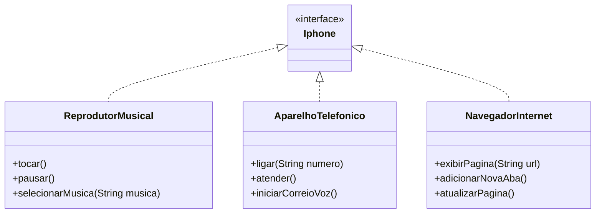

# Desafio Bootcamp – Interface Iphone em Java

🎯 Este projeto simula a estrutura básica de um iPhone, utilizando os conceitos de **Programação Orientada a Objetos (POO)** em Java. A proposta é implementar uma **interface chamada `Iphone`** com 3 classes responsáveis por funcionalidades específicas:

- Reprodutor Musical  
- Aparelho Telefônico  
- Navegador na Internet  

---

## Diagrama de Classes (UML)



### 🚀 Tecnologias
- Java 17+
- UML (Mermaid)
- GitHub

### ⚙ Como executar o projeto
Para testar o funcionamento das classes, utilize a classe Main.java, que está disponível no repositório.

```
javac Main.java
java Main
```

### 👋🏻 Autor 
- Desenvolvido por Fillipe Soranso.
- Projeto do Bootcamp Bradesco - Java Cloud Native na plataforma da DIO.


